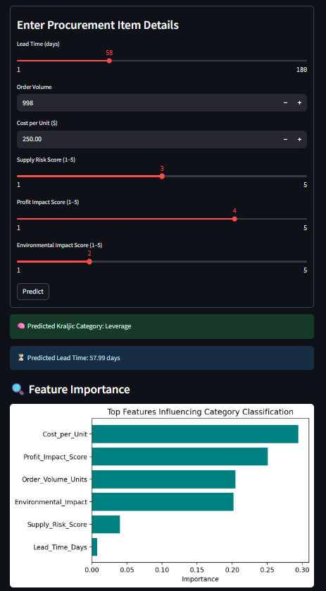

# 🛠️ SmartProcure: Procurement Intelligence System



**SmartProcure** is an intelligent decision-support system that automates the classification of procurement items using the **Kraljic Matrix** and predicts **lead time** using machine learning. It helps organizations make strategic sourcing decisions by assessing cost, risk, volume, and environmental impact.

---

## 🚀 Project Overview

In supply chain management, classifying items based on **supply risk** and **profit impact** is critical but often subjective and time-consuming. **SmartProcure** leverages machine learning to:

- 📊 **Classify items** into Kraljic quadrants: Strategic, Leverage, Bottleneck, Non-Critical.
- ⏱️ **Predict lead time** for procurement items.
- 🌱 Integrate **sustainability and risk insights** into procurement decision-making.

---

## 🧠 Models Used

| Task                         | Algorithm               |
|-----------------------------|--------------------------|
| Classification              | Random Forest Classifier |
| Lead Time Prediction        | Random Forest Regressor  |
| Baselines Compared          | Logistic Regression, SVM, KNN, Naive Bayes, Decision Tree, Gradient Boosting |
| Regression Benchmarks       | Linear, Ridge, Lasso, SVR, Tree-based Regressors |

✅ Best models were selected based on **Accuracy (Classification)** and **R² / RMSE (Regression)**.

---

## 📦 Dataset Details

- **Source**: [Kaggle - Procurement Strategy Dataset for Kraljic Matrix](https://www.kaggle.com/datasets/shahriarkabir/procurement-strategy-dataset-for-kraljic-matrix)
- **Size**: 1,000 records
- **File**: `realistic_kraljic_dataset.csv`
- **Features**:
  - Lead_Time_Days
  - Order_Volume_Units
  - Cost_per_Unit
  - Supply_Risk_Score
  - Profit_Impact_Score
  - Environmental_Impact
  - Single_Source_Risk
  - Kraljic_Category (Target)

---

## 📊 Exploratory Data Analysis Highlights

- ⚖️ Balanced class distribution across Kraljic categories
- 📈 Strong correlations observed:
  - `Cost_per_Unit` ↔ `Supply_Risk_Score` & `Environmental_Impact`
- 🗺️ Region-wise variability in `Lead_Time_Days`
- 🔍 Feature importance shows `Cost_per_Unit` and `Profit_Impact_Score` as key drivers

---

## 🖥️ Streamlit Dashboard

Launch the interactive dashboard to:
- Input item characteristics
- View predicted Kraljic category and estimated lead time
- Visualize feature importances

### 🔗 Preview


---

## ⚙️ How to Run Locally

### 1️⃣ Clone the Repository

```bash
git clone https://github.com/Kuvedant/SmartProcure.git
cd SmartProcure
```

```bash
pip install -r requirements.txt

```

```bash
streamlit run smartprocure_dashboard.py
```

```bash
SmartProcure/
│
├── smartprocure_dashboard.py         # Streamlit app
├── SmartProcureProject.ipynb         # Main notebook with EDA + Modeling
├── realistic_kraljic_dataset.csv     # Dataset
├── rf_classifier.pkl                 # Trained classification model
├── rf_regressor.pkl                 # Trained regression model
├── dashboard_preview.png             # Dashboard UI screenshot
├── requirements.txt
└── README.md
```

```

---

### ✅ To Use

1. Save this content in a file named `README.md` in your GitHub repo.
2. Place your dashboard screenshot in the repo as `dashboard_preview.png`.

Let me know if you also want a PDF version for submission or a DOCX export.
```
